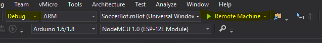
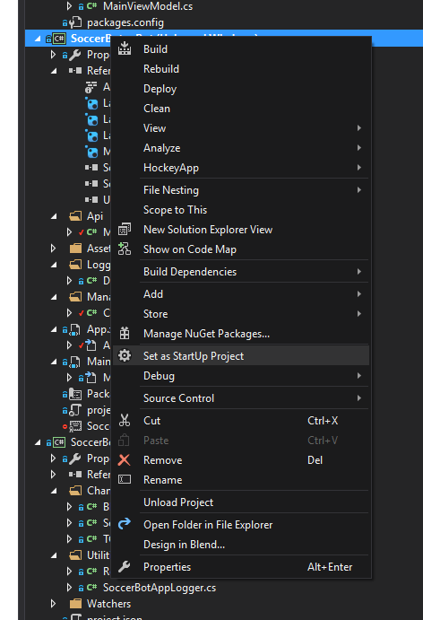
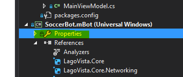
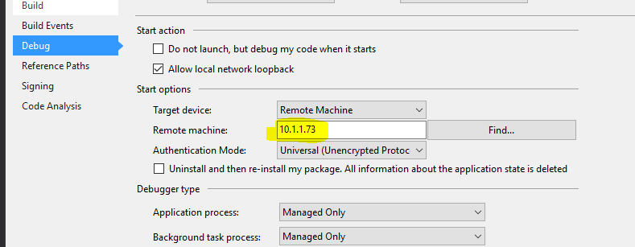
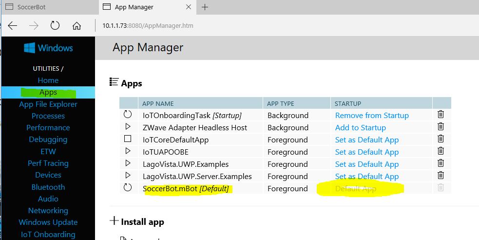
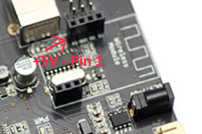
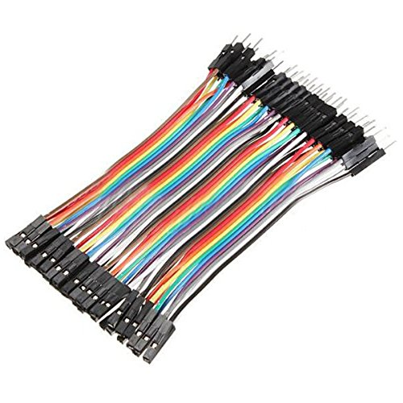

# Connecting mBot to Win 10 IoT Core

### Installing the SoccerBot App

First you'll need to install Windows 10 IoT Core on your Raspberry Pi, you can find instructions [here](GettingStarted.md)

You will need to ensure you have Visual Studio 2015 installed on your machine and have the [SoccerBot repository](https://github.com/bytemaster-0xff/WinIoTSoccerBot) already [cloned](https://help.github.com/articles/cloning-a-repository/) and ready on your machine.

1. Open File Explorer and navigate to the [SoccerBotApp](https://github.com/bytemaster-0xff/WinIoTSoccerBot/tree/master/src/SoccerBotApp) directory.
2. Open the file SoccerBotApp.sln
3. Set your platform type to ARM and debug type to Remote Machine

4. Set the **SoccerBot.mBot (Universal Windows)** program to the startup application.

5. Right mouse click on the **Properties** node within **SoccerBot.mBot (Universal Windows)** app

6. Find the debug tab and enter the IP address you obtained from the getting started screen.

You can also hit find and find your machine by name, but using your IP address will work 100% of the time.

7. Start your application like you would start a normal VS.NET project.

After your application is running you should be able to navigate to the IP address in a browser and see a screen similar to:

8) You should set the SoccerBot app as the default app, to do this navigate to your Win 10 IoT core admin web site. you can get there by entering the http://IPADDRESS:8080 for the IP add that you received in the previous step.  When prompted enter Administrator and the password you selected.
9) Go to the Apps tab and select SoccerBot.App as the default app.

10) Resetart your raspberry pi and make sure you can stil go to the SoccerBot default web site as identified in the step above.

### Connecting the Raspberry Pi to the mBot

1) Disconnect your bluetooth module
2) Identify the expansion port on our Rapberry Pi, it should have a pin out similar to

3) Identify the 4 pin port that you disconnected the bluetooth module from

**Important Note: Pin 1 will be the pin identified by +5V, the print is very hard to read but it will be the pin that would be towards the middle of the connector, not on the edge, this is denoted with red print on the image**

We will need to connect the power from your mBot as well as the Serial Port Lines to the Raspberry Pi

Using a Male to Femail Jumper similar to:

Make the following connections
    
    Signal   Raspberry Pi      mBot
    ==================================
    +5V         Pin 4  <------> Pin 1
    Gnd         Pin 6  <------> Pin 2
    Tx From Pi  Pin 8  <------> Pin 3
    Rx To Pi    Pin 10 <------> Pin 4

Once you have made these connections, restart your Raspberry Pi, go back to the Raspberry Pi Home page and now be able to control the bot from the web page.