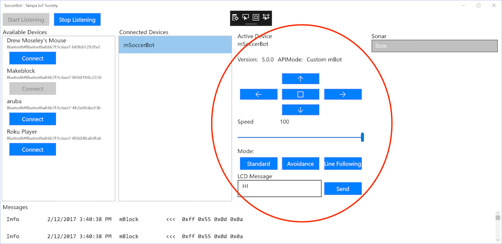

# Windows 10 Desktop Control App
## Getting Started
There is a Universal Windows Platform (UWP) app to control the MBlock Robot.  This is similar in functionality to the IR Remote Control or the Mobile Phone App, except that it will run on your Windows laptop/desktop machine.

1. Check out the [WinIoTSoccerBot github repo](https://github.com/bytemaster-0xff/WinIoTSoccerBot/).
1. Launch Visual Studio.  Double-click the _SoccerBot.sln_ file to launch visual studio with the proper project file. 

1. Select the _SoccerBotApp (Universal Windows)_ solution and the _x86_ architecture in the toolbar. 

1. Build the solution using Visual Studio. 

1. Launch the Windows application. 

1. Using the Windows application, scan for Bluetooth devices and connect to your Mbot. 

1. Control your robot's motion using the GUI controls. 

