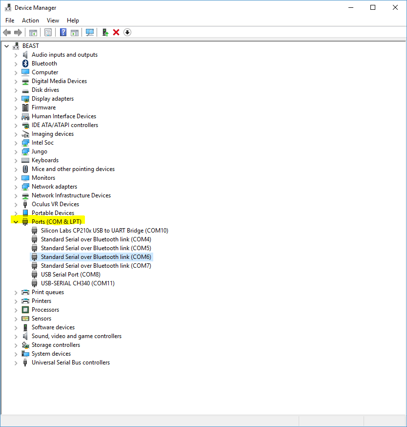
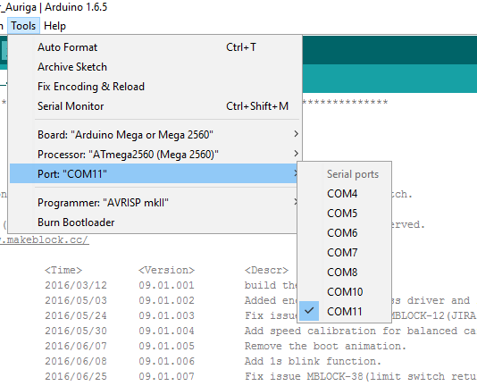
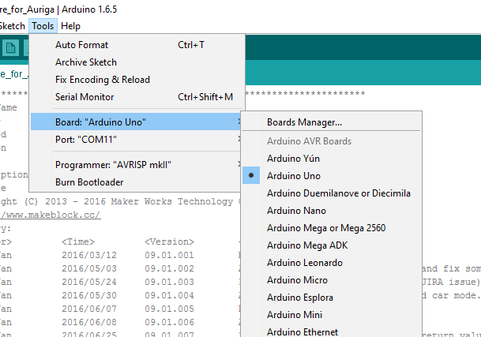
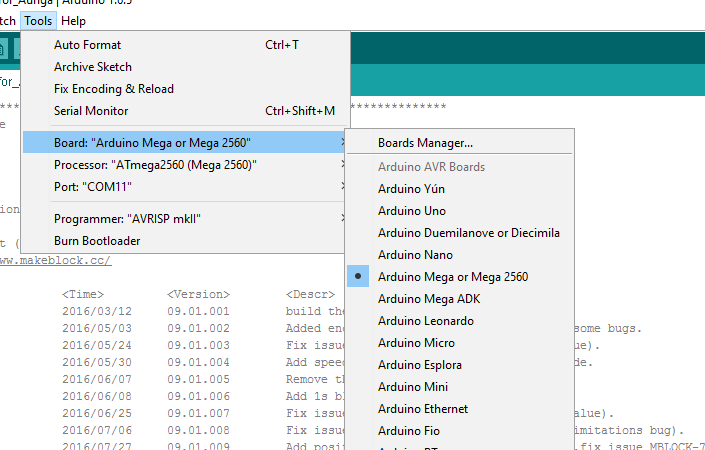

# Windows 10 IoT Core - Soccer Bot Repo
## Getting Started

### Software Requirements

[Visual Studio 2015](https://www.microsoftstore.com/store/msusa/en_US/cat/Visual-Studio-2015/categoryID.69407500?s_kwcid=AL!4249!10!13675262506!84040865656&ef_id=WA5uGgAABWJOSWR6:20170130221540:s)
Make sure when you install Visual Studio, you install support for building UWP/Windows Store apps.  The minimum [Windows SDK](https://developer.microsoft.com/en-US/windows/downloads/windows-10-sdk) we support is 14393

[Arduino](https://www.arduino.com) - Necessary to install [custom Arduino firmware](https://github.com/bytemaster-0xff/WinIoTSoccerBot/tree/master/src/mBotFirmware).  At this time installing custom firmware isn't 100% required bit it will provide better performance and advanved features.

[Visual Micro](https://www.VisualMicro.com) - Not 100% necessary but provides a much better IDE for working with Arduino.

### Software Organization
There are three main programs that make up the client portion of the Soccer Bot Platform

Windows Store App Running on a PC - Used to manually control your SoccerBot

Windows UWP app (Windows 10 IoT Core) running on Raspberry Pi - A small backpack for the robot to provide additional computing power and cloud connectivity

Custom Firmware - Additional features and tuned software to work with the Windows 10 IoT Core app.

### Installing Firmware on mBot

Note: We are using custom firmware for optimziation, do so at your own risk.  Every effort has been made to ensure that it will not brick your device, however if you have problems you should be able to install the default firmware from the MakeBlock [GitHub repository](https://github.com/Makeblock-official/)

The mBot is very similar to an Arduino.  If you know how to upload firmware to and Arduino, you know how to upload firmware to your mBot platform.

#### Open your IDE and load the Firmware Source Files
You have two options to upload the firmware, if all you are doing is uploading the existing firmware to get your mBot up and running, you should probably just use the Arduino IDE as specified above.  If you are planning on making changes and are a Visual Studio user, you should choose Visual Micro.  

Although the steps identified heare are for the Arduino IDE, using Visual Micro is very similar.

##### Basic mBot and Rover
Our custom firmware is located [WinIoTSoccerBot/src/mBotFirmware](https://github.com/bytemaster-0xff/WinIoTSoccerBot/tree/master/src/mBotFirmware).  This has been copied from the original MakeBlock repo and has been optimzied for working with our custom Raspberry PI app.  We will make a best effort to maintain compatibility between our Win 10 IoT core app and the stock firmware however you are encoraged to use the custom firmware.  You can find the stock firmware [here](https://github.com/Makeblock-official/Makeblock-Firmware/tree/master/mbot_firmware):

The easiest way to work with the custom firmware is to simply [clone](https://help.github.com/articles/cloning-a-repository) the [Soccer Bot Repo](https://github.com/bytemaster-0xff/WinIoTSoccerBot) and open the file in either the Arduino IDE or Visual Macro

##### Ranger
Although we are using custom firmware, you can follow the instructions provided at the [MakeBlock Site](http://learn.makeblock.com/learning-arduino-programming-ranger/) for details on how to update the stock firmware.

The latest custom firmware for the Ranger can be found on the [Official Make Block respository](https://github.com/Makeblock-official) under [libraries](https://github.com/Makeblock-official/Makeblock-Libraries).  The source for the latest version is [here](https://github.com/Makeblock-official/Makeblock-Libraries/tree/master/makeblock/examples/Firmware_for_Auriga).

If you decide to install the custom firmware you will still need to follow the instructions on this site to add the required libraries.

#### Identify COM Port
First off you'll need to identify the serial port your mBot is connected to, the easiest way to do this is to plug your mBot into a USB port. You should hear the sound of the USB device being recognized and connected.  Then open your device manager by typing **Device Manager** at the start prompt in windows.  Then find the Ports (COM and LPT1 section)

Watch the ports that are currently listed.  You may/may not have the same number of ports as shown in the image below.  Unplug your mBot.  Watch for the port that disappeared.  Then plug it back in, the port that disappeared and reappeared is the one you want to work with.

After you have identified the COM port, you will need to select it in the Arduino IDE

#### Select Board
In addition to the serial port, you also need to identify the type of board you are targetting

##### Basic/Rover mBots
For installing firmware on the Basic mBot and the Rover mBots, you will need to use the Arduino Uno board

##### Ranger mBot
For installing firmware on the Ranger mBot select the ATMega2560

At this point you are ready to install the firmware.  

### Install Windows 10 IoT Core

Follow the instructions [here](https://developer.microsoft.com/en-us/windows/iot/GetStarted) to get Windows 10 IoT core up and running your Rasperry Pi

In summary you will need to 

1. Download the Windows 10 IoT Core Dashbaord
2. Give your installation a name, this will be used to identify your Soccer Bot
3. Set a password to allow admin access, remember this password
4. "Burn" the Win 10 IoT Core image onto your MicroSD card
5. Install that card in your Raspberry Pi
6. If at all possible you should connect a monitor and keyboard to your Raspbery Pi to get started
7. Apply network and power to your Raspberry Pi
8. Let it go through the initial power up sequence, be patient
9. Observe the IP address of your Raspberry Pi
10. If you don't have an monitor, you can find the ip address by typing 

    ping [COMPUTERNAME] -4

11. You can also open use the Windows 10 IoT Core Dashboard to look for your device, it won't always find it.
12. Open a browser and open the page admin page this will be at http://[MYIP ADDRESS]:8080
13. You will be prompted for a user name and password, enter the user name administrator and the password you created above.
14. Connect your Raspberry Pi to the WiFi network under the network tab.

Again, much better instructions can be found at the [Windows Developer Site](https://developer.microsoft.com/en-us/windows/iot/GetStarted)

### Installing the mBot app on Windows 10 IoT Core
