# Windows 10 IoT Core - Soccer Bot Repo
## Shopping List

### Supported Platforms
The primary platform for our Soccer Bot will be the mBot platform.  There are three varients that are supported, we encourage you to build your own robot
but selecting one of these platforms will make things easier and the configuration will be documented here.

What's nice about these platforms is that they are arduino based which means we can provide custom firmware which is included in this repository. 

### [Basic Version](https://www.amazon.com/Makeblock-DIY-mBot-Kit-Bluetooth/dp/B01FS7BGJI/ref=sr_1_3?ie=UTF8&qid=1485812877&sr=8-3&keywords=mBot)

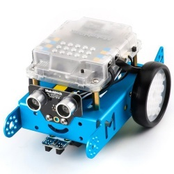

### [Rover Version](https://www.amazon.com/dp/B00W6Y194Y?psc=1)

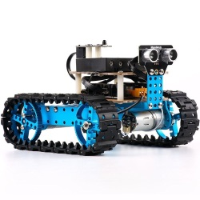

### [Ranger Version](https://www.amazon.com/Makeblock-Ranger-Transformable-Educational-Robot/dp/B01DY3OTHO/ref=sr_1_6?ie=UTF8&qid=1485812877&sr=8-6&keywords=mBot)

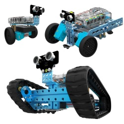

## The Brains

The built in board on the mBot (or your platform) will be responsible for controlling the motors and some sensors to move the robot.  Our intention is to build an smart robot that can navigate on it's on (mostly).  

We will be using a Raspberry Pi running Windows 10 IoT core to create the intelligence.  This will not only provide a more friendly environemnt to build our logic - C# but also provides considerably more storage as well as network capability.

For this you will need a Rasperry Pi capable running Windows 10 IoT core.  We recommend Raspberry Pi 3 since it has built in WiFi.

### [Rasberry Pi 3](https://www.amazon.com/Raspberry-Computer-Performance-Anodized-Heatsink/dp/B01KGMMI1A/ref=sr_1_1?s=electronics&ie=UTF8&qid=1485813892&sr=1-1-spons&keywords=Raspberry+Pi+3&psc=1)

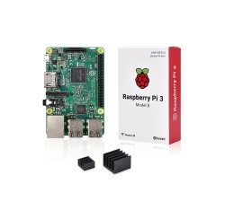

You will also need an Micro SD card to install the firmware.  Below find an example.

### [Micro SD Card (32GB Recommended)](https://www.amazon.com/SanDisk-microSDXC-Standard-Packaging-SDSQUNC-064G-GN6MA/dp/B010Q588D4/ref=sr_1_1?s=pc&ie=UTF8&qid=1485814127&sr=1-1&keywords=Micro+SD+card)

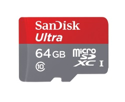

### Mounting Plate for Raspberry PI to mBot

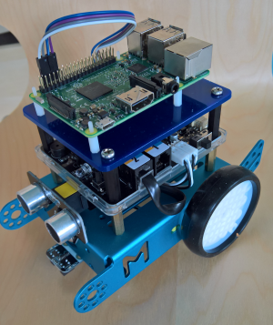

Contact kevinw@software-logistics.com for more details.

### Attaching Mounting Plate to mBot
The Raspberry PI Mounting Plate needs to be attached to the mBot with some stand-offs.  You may also need some miscellaneous M4 mounting hardware such as nuts a screws.
#### Option 1
#### [M4x30 Standoffs](https://www.amazon.com/gp/product/B0177VGC92/ref=oh_aui_search_detailpage?ie=UTF8&psc=1)

#### Option 2
#### [M4x25 Plastic Stand Offs](https://www.amazon.com/gp/product/B016VQYGGA/ref=od_aui_detailpages00?ie=UTF8&psc=1)
Used to attach the mounting board for the Raspberry Pi to the mBot

### Attaching the Raspberry PI to the Mounting Plate
The kit below is relativley inexpensive and contains everything you need.  You only need a few parts so you will have left overs for future projects.

#### [M2.5 Standoff Kit](https://www.amazon.com/HVAZI-Standoff-Stainless-Assortment-Male-Female/dp/B01L06CUJG/ref=sr_1_1?ie=UTF8&qid=1486738108&sr=8-1-spons&keywords=M2.5%C2%A0standoff&psc=1)

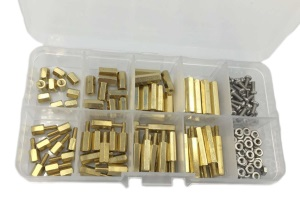

## Powering mBot

There will be muliple options for powering our Raspberry PI and mBot.  The long term option will likely be a 7.4 or 11.2 LIPO battery.  This will power the Raspberry PI and the mBot and it's motors.  More research needs to be done.  

Our current solution is to use a relatively wireless cheap phone charger to power the Raspberry PI and the standard battery pack or LIPO to power the mBot.

See options below for a portable power source.  If you already have one, you can use that and a Micro USB cable.

### Portable 5V Power Source (Can use any Cell Phone Charger)
Note: Most phone charging batteries should work.  We will provide more specifications once we do more testing, the better the charger, the longer the Raspberry Pi will run. 
### [Power Supply](https://www.amazon.com/Anker-PowerCore-Lipstick-Sized-Generation-Batteries/dp/B005X1Y7I2/ref=sr_1_5?ie=UTF8&qid=1488811969&sr=8-5&keywords=phone+battery+backup)

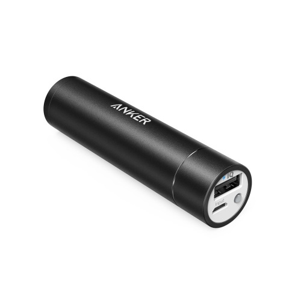

OR 

### [Larger Power Supply](https://www.amazon.com/gp/product/B00P7N0320/ref=crt_ewc_title_dp_1?ie=UTF8&psc=1&smid=A294P4X9EWVXLJ)
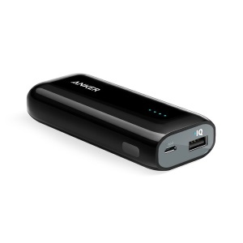

### MicroUSB Cable (Short is good)
### [USB Cable](https://www.amazon.com/Pack-micro-USB-Compatible-Powering-Streaming/dp/B01HBMOEAQ/ref=sr_1_5?ie=UTF8&qid=1488817223&sr=8-5&keywords=6%22+USB+Micro+cable)
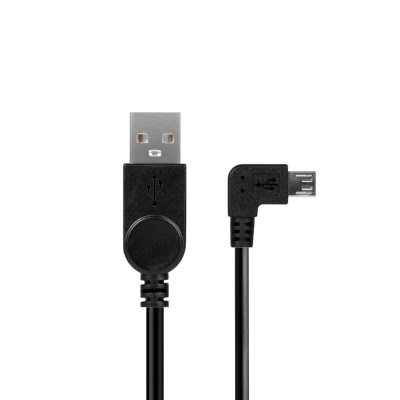

## XBox Controller (Wired or Wireless)

As one of our interim steps of developing our Fully Autonmous bots we will use an XBox controller connected to the PC to control our robot.

If you have an existing Wired controller from an old XBox that should work as well.  If you have a wireless XBox controller, you will need a wireless adapter for the PC.

### XBox Controllers
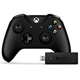

#### [XBOX Controller - OK]()

#### [XBOX Controller - Better](https://www.amazon.com/Microsoft-Wired-Controller-Windows-Console/dp/B004QRKWLA/ref=sr_1_98?s=videogames&ie=UTF8&qid=1488820311&sr=1-98&keywords=xbox%C2%A0+controller)

#### [XBOX Controller - Best - Wireless](https://www.amazon.com/Microsoft-Xbox-Controller-Wireless-Adapter-Windows/dp/B015IX3X3E/ref=sr_1_2?ie=UTF8&qid=1488820851&sr=8-2&keywords=xbox+controller+wireless+adapter+for+windows+10)

#### [XBOX Controller - Elite (note requires wireless adapter)](https://www.amazon.com/Xbox-One-Elite-Wireless-Controller/dp/B00ZDNNRB8/ref=sr_1_1?s=electronics&ie=UTF8&qid=1488820416&sr=1-1&keywords=xbox+one+elite)

### XBox Wireless Adapters
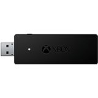
#### [XBox 360 Wireless Adapter](https://www.amazon.com/Microsoft-Xbox-Wireless-Receiver-Windows/dp/B000HZFCT2/ref=sr_1_5?ie=UTF8&qid=1488820851&sr=8-5&keywords=xbox+controller+wireless+adapter+for+windows+10)

#### [XBox One Wireless Adapter](https://www.amazon.com/Microsoft-Xbox-Wireless-Adapter-Windows/dp/B00ZB7W4QU/ref=sr_1_3?ie=UTF8&qid=1488820851&sr=8-3&keywords=xbox+controller+wireless+adapter+for+windows+10)

## Tools

Note: These are very basic tools I'm recommending with the interest of keeping the prices down as much as possible.  I already have most of these so I'm not going to be purchasing these and can't make a claim one-way-or-another as to their quality.  They should however work for our intended purpose.

## Entry Level
#### [Soldering Station](https://www.amazon.com/Pictek-Soldering-Adjustable-Temperature-Welding/dp/B01HXDP85S/ref=sr_1_2?ie=UTF8&qid=1490719685&sr=8-2-spons&keywords=Soldering+iron&psc=1)
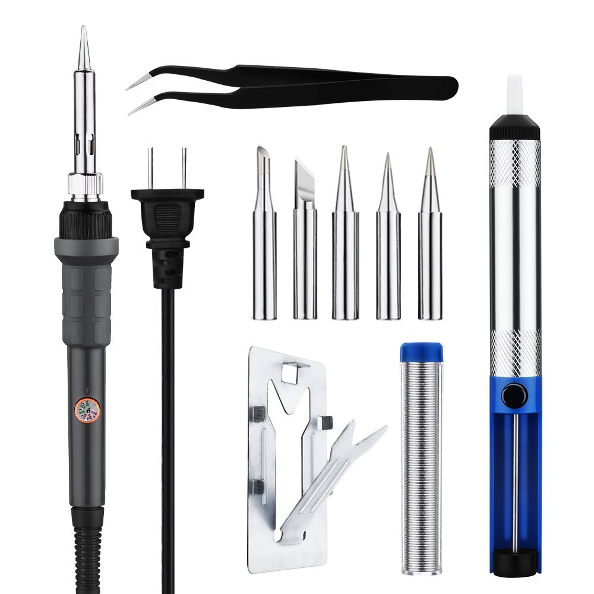

## Decent
#### [Weller Soldering Station](https://www.amazon.com/Weller-WLC100-40-Watt-Soldering-Station/dp/B000AS28UC/ref=sr_1_5?ie=UTF8&qid=1490719685&sr=8-5&keywords=Soldering+iron)
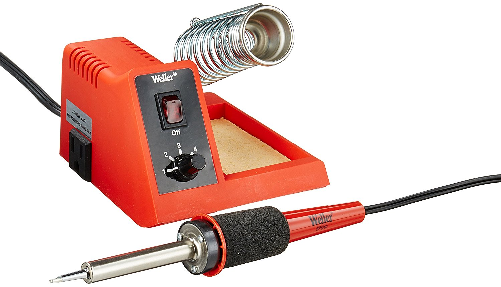