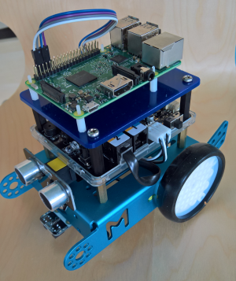

# Windows 10 IoT Core - ~~Soccer~~ Laser Tank Bot
## [Tampa IoT Society](https://www.meetup.com/Tampa-Bay-NET-Microframeworks-Developer-Group)

BREAKING NEWS: As of the last meeting we decided to change our sport from Soccer to Laser Battle Tanks...no our lasers won't burn up the enemy but will "light-them-up"!

For more details please review our documentation directory.

To sign up for the Slack Channel, please contact kevinw@software-logistics.com

Added custom firmware for mBot with the following features:
* Send both left and right motor in one command, previous version took two calls and we saw the robot twist left/right while the first motor was stopped and the other was stopping
* Added the ability to set the mode through the API

The first thing the app does is requests the version from the mBot.  Our custom firmware will start at 5.0 so if it returns 5.0 it will use our enhanced features otherwise it will use the default firmware on the mBot 

## More
* [Getting Started](GettingStarted.md)
* [mBot Help](mBotInstructions.md)
* [Getting Going with Windows 10 IoT Core](ConnectWinIoT.md)
* [Shopping List](PartsList.md)
* [Get Involved!](HelpWanted.md)

## Quick Links:

* [Windows 10 IoT Site](https://developer.microsoft.com/en-us/windows/iot/GetStarted)
* [VS.Net Community Edition](https://download.microsoft.com/download/D/2/3/D23F4D0F-BA2D-4600-8725-6CCECEA05196/vs_community_ENU.exe)
* [Windows Universal App SDK v14393](https://download.microsoft.com/download/C/D/8/CD8533F8-5324-4D30-824C-B834C5AD51F9/standalonesdk/sdksetup.exe)
* [Arduino IDE](https://www.microsoft.com/en-us/store/p/arduino-ide/9nblggh4rsd8) 
* [Visual Studio Arduino plugin](https://visualstudiogallery.msdn.microsoft.com/069a905d-387d-4415-bc37-665a5ac9caba/file/208854/78/Visual.Micro.Arduino.Studio.vsix)
* [Windows 10 IoT Remote Client](https://www.microsoft.com/en-us/store/p/windows-iot-remote-client/9nblggh5mnxz)

## Project Plan and Schedule

##### Dec 2016 - Build the Core Robot (Completed)
##### Jan 2017 - Connect our mBot to Windows 10 UWP App with Blue Tooth (Completed)
##### Feb 2017 - Attach Win 10 IoT Core to our mBot and Control via Web (Completed)
##### Mar 2017 - Make sure everyone can connect their mBot to Win 10 IoT Core, Compass, XBox Controller, Review Power Options
##### Apr 2017 - Build our Sensor Board and test interactions
##### May 2017 - Connect mBot to Cloud and test mutliple unit control
##### Jun 2017 - Add Laser Turret and Detection
##### Jul 2017 - Start Autonmous Testings
##### Aug 2017 - More Autonmous Testings
##### Sep 2017 - Round one!
##### Oct 2017 - Show-Off at Tampa Code Camp