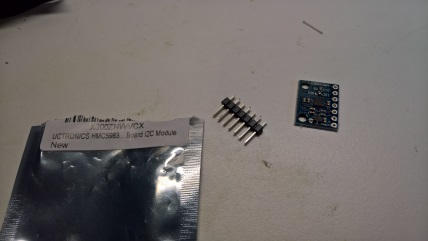

# Sensor Board V1.0
Our Sensor Board will be used to attach 8 proximity sensors, a compass and allow for 4 GPIO accessories and 3 I2C Accessories.  It also exposes all the pins from the RaspberryPi so additional accessories can be attached.

## Parts List
1) Sensor PCB Board (Coming Soon)
1) [IR Sensors](https://www.amazon.com/gp/product/B01I57HIJ0/ref=oh_aui_detailpage_o05_s00?ie=UTF8&psc=1)
2) [Raspberry Pi Connector](https://www.amazon.com/gp/product/B01IRRCEBK/ref=oh_aui_detailpage_o04_s00?ie=UTF8&psc=1)
4) [Straight and Right Angle 0.1 Headers](https://www.amazon.com/VAPKER-Headers-Connector-Housing-Connectors/dp/B01FWAV61O/ref=sr_1_7?s=electronics&ie=UTF8&qid=1491391221&sr=1-7&keywords=0.1+inch+header+pins)
5) [HMC5983 I2C Compass](https://www.amazon.com/UCTRONICS-HMC5983-Temperature-Compensation-3-Axial/dp/B01DILCSP2/ref=sr_1_1?s=electronics&ie=UTF8&qid=1491391265&sr=1-1&keywords=HMC5983)  

## Schematic
[Board RevV1](Documentation/BoardSchematicV1.0.png)

## Known Issues and Work arounds
Just like Software, Hardware can have bugs in it as well, unfortunately sometimes these aren't discovered until the board is actually created.  Our V1.0 prototype has a couple bugs but have relatively easy work arounds

### PLEASE READ AND UNDERSTAND PRIOR TO ASSEMBLING YOUR BOARD
**Bug #1** - The three IR sensors on the right hand side of the board have their pads "backwards", Work-Around - Install the IR Sensor Upside Down, you have for sensor boards with the pins coming out the bottom rather than the top, these are for the right top, right, right rear and rear.   The IR Sensors on the Right side will appear upside down but will function just fine.  The Rear sensor needs to be installed on the top of the board so it will provide clearance for the USB and Network ports.

**Bug #2** - There is a small gap on the underside of the board between the center pin on the front IR sensor.  This will be fixed prior to distribution of the Board.

## Step 1 - Organize and Identify Parts
There are a number of distinct parts that make up our sensor board
1) Main Connector for Raspberry Pi

2) 8x IR Sensors

3) HMC5983 Comppass (attached to I2C Bus)

4) Right Angle 4 Pin Connector - To Connect the mBot to our Raspberry Pi

5) 2x 2904 NPN Transistors - Used to switch power on/off of the IR Sensors

6) 2x 1K or 470K Resistor (Your kit may contain either one of these) - These are used to limit the current flow through the Transistor

7) 4x 3 Pin Connector

## Step 2 - Install the IR Sensors
In this step you will be installing 8 IR Sensors on your Sensor Board, these will be used to detect obstacles within a small distance of your bot.

1. Lay the board on a flat surface with the top side facing up.
1. Locate the 8 IR Sensors, for of them will have the pins facing up and four will have them facing down.
1. You will need to bend the pins so they are pointing straight up or down based on the sensor you have, easiest way to do this is to take a small pliers and just bend them, be careful so you don't break them. 
1. Next take the four IR Sensors with the **pins facing up**, insert them in the holes labeled REARLEFT, LEFT, FRONTLEFT, FRONT.

1 new message since 11:51 AM
Mark as read (esc)Mark as read
Channel #general, 1 new message since 8:29 PM...
Open in archives
Today at 10:23:14 AM

@bytemaster
1. Take three of the IR Sensors with the **pins facing down**, turn them over so the components are facing down, and place them in the holes labled RIGHTREAR, RIGHT, FRONTRIGHT.  Your IR Sensors will have the lights facing down.
1. Once you are confident that the sensor boards are laying flat, solder each of the pins.
1. Take the final IR Sensor with the pins facing down and place it on the top of the board in the REAR slot with the pins facing down
1. Solder all the pins to the board.

## Step 3 - Install the 4-Pin Right Angle Connector
1. If you purchased the kit from above, take one of the longer strips of right angle pins and snip off a 4 pin section.
2. Take the 4 pin connector, place it in the 4 holes to the right of the main connector on the top of the board and solder it in place.
![Alt]

## Step 4 - Install the two transistors
1. Install the two transistors into the board you will need to bend the pins slightly to allow them to go into the board.
**IMPORTANT NOTE** The transistor must be inserted so that the flat part is lined up with the white outline (silkscreen) on the board and the half circle with the half circle on the board

2. Solder the pins to the board
https://soccerbot.slack.com/team/bytemaster
## Step 5 - Install the two resistors
1. Install the two resistors and solder them into the board, their orientation doesn't matter.

## Step 6 - Install the Compass
1. Insert the 7 Pin header connector into the compass board and solder it in place.
2. Take your side cutters and trim the 7th pin, the one by the hold labled DRDY, this needs to be removed so it will fit in the board.
3. Place the Compass Board into the Main Board as show below and solder it in place.

**NOTE A** Pin through board

**NOTE B** Removed Pin

## Step 7 - Install the 4x 3-Pin Accessory Connectors
1. If you purchased the kit from above, just take one of the longer strips of straight pins and divide it into 4 - 3 Pin sections. 
2. Install the four, 3-Pin Accessory Connector, it may be easier to place them in the board, and them tape them place place, then flip the board over and solder them into the board.

## Step 8 - Install the Raspberry Pi to Sensor Board Connector.
1.  Install the 40 Pin Connector so the pins are exposed through the top of the board
2.  Solder the connector in place.  It may be easiest to do so using the method shown below

**IMPORTANT** Make sure that the pins are exposed on the top of the board, most other mistakes we can likely fix with the solder-sucker.  There are too many pins and they are too tall to replace this on the board.  If you install this wrong you will likely have to scrap the board.  Any questions, please ask.

## Step 9 - Fix my bug (Add a jumper : ) )
1.  Turn your board upside down
2.  Locate the FRONT and FRONTLEFT IR Sensors
3.  Take the small chunk of wire in your kit and attach it between the two pins labeled ground.
4.  Solder the wires in place

## Step 10 - Inspect Board
1.  Visually inspect the solder connections you made and make sure there are no shorts
2.  Optionally connect a meter between the +5V and GND pins on the right angle connector it should not measure 0 Ohms
